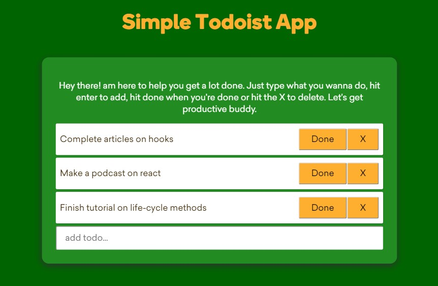

# Simple Todo list app(React hooks)
> A simple todo app built to help new engineers @kobolabs get up to speed with react hooks via hands on coding.



## Please follow these instructions to get started

```sh
git clone git@github.com:Raymond-Osy/Todoist-with-react-hooks.git
```

Change directory

```sh
cd Todoist-with-react-hooks
```

Install Package dependencies

```sh
npm install
```

Run the application

```sh
npm start
```

## Meta

Raymond Akalonu – [@Rayz_of_Daimond](https://twitter.com/Rayz_of_Daimond) – raymond.akalonu@gmail.com

